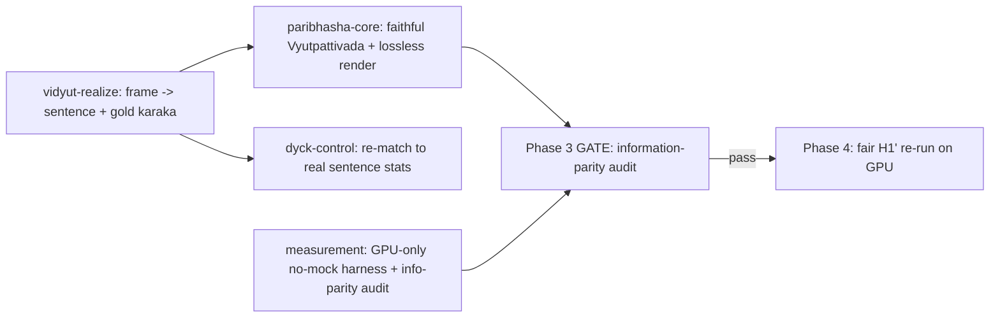

# PSALM worktree launch plan (four execution workstreams — core rebuild)

> **Core-rebuild reframe (2026-06-03).** Four worktrees (vidyut / paribhasha / dyck /
> **measurement**), forked from `origin/main` after push. **GPU-only, no-mock** (ADR-0035):
> there is no "CPU-first" path; CPU is allowed only for device-free unit tests, never for a
> reported metric. Governed by ADR-0033/0034/0035 and the information-parity gate.

**Status:** Planning only — no worktrees forked by this document.
**Sign-off required:** GATE 0 (invalidation + ADRs 0033-35 + reframed spec + acceptance YAMLs).

Spec: [`psalm-spec-v2.md`](./psalm-spec-v2.md). PRD: [`psalm-prd-v2.md`](./psalm-prd-v2.md).

---

## 1. Worktree audit summary

| Worktree | Branch | Tip | Relevance to vidyut / paribhasha / dyck |
|---|---|---|---|
| `PSALM` | `main` | `817384b` | **Integration tip:** paribhasha package, crystallization M1, h1prime scripts, Wave-3 |
| `PSALM-integration` | `integration/data-engine-v2` | `817384b` | Same as main; owns future `matrix.py` / assembly merges |
| `PSALM-h1run` | `workstream/h1prime-run` | `817384b` | H1′ pilot artifact `docs/data/h1prime-pilot-60m.json` — **INVALIDATED / NOT EVIDENCE** (mock-venue leakage); preserve uncommitted files as checkpoint |
| `PSALM-cryst-live` | `workstream/crystallization-live` | `817384b` | Crystallization module + M1 tests; realization probe |
| `PSALM-phase2` | `phase-2-h1` | `9e2fe64` | **Closed H1** COGS battery; older code (no paribhasha on src); historical only |
| `PSALM-phase1` | `phase-1-data` | `5a64ed2` | Phase-1 closure docs; tokenizer/diversity JSON |
| `PSALM-planning` | `planning/reframe-2026-06` | `d9bb9a9` | **This plan**; docs ahead/behind code — do not use for execution src |

### 1.1 vidyut — what exists

| Asset | Location | State |
|---|---|---|
| Vidyut adapter | `src/psalm/infrastructure/generators/vidyut_source.py` | Implemented (tiṅanta grid, derivation) |
| Saṃsādhanī adapter | `samsadhani.py` | Implemented; external Docker |
| Kāraka frames | `domain/data/karaka_frames.py` | Implemented |
| Crystallization | `infrastructure/crystallization/` | M1 implemented; 15 tests; 8.39M / 32,976 ready. "0 live sentences" was `--skip-generation` (not rejection); live Saṃsādhanī accepts ~92% — realization rewired to `VidyutFrameRealizer` (ADR-0033) |
| GB10 | `docs/data/gb10-stack-status.md` | Phase-1 CPU only; ADR-0022 open |
| Tests | `test_vidyut_source.py`, `test_vidyut_aarch64.py`, `test_crystallization_m1.py` | On `main` |

**Fork from:** `origin/main` (after Phase-1 push) or fresh branch `workstream/vidyut` from `main`.
**Do not fork from:** `phase-2-h1` (stale generators), `planning/reframe-2026-06` (stale `src/`).

### 1.2 paribhasha — what exists

| Asset | Location | State |
|---|---|---|
| Package | `generators/paribhasha/*` | On `main` only (not in planning worktree `src/`) |
| Vyutpattivāda | `shabdabodha.py` | Partial rules VYU-001…008 |
| Aligned source | `shabdabodha_aligned_source.py` + fixture | Wired; 2 tests |
| Adapter | `paribhasha_source.py` | Thin; 1 test file |
| Enum | `PrePretrainSource.PARIBHASHA` | On `main` |

**Fork from:** `origin/main` (after Phase-1 push).
**Depends on:** vidyut fixture contract (`AnnotatedSentence` + kāraka).

### 1.3 dyck — what exists

| Asset | Location | State |
|---|---|---|
| Pure generator | `domain/data/dyck.py` + `hu_replication_config()` | Implemented |
| Adapter | `dyck_source.py` | Implemented |
| Matching | `matching.py` + `DEFAULT_KEYS` | Implemented; freeze |
| Tests | `test_dyck.py`, `test_dyck_properties.py` | On `main` and `phase-2-h1` |

**Fork from:** `origin/main` (after Phase-1 push) — includes latest Hu pin helper.
**Depends on:** vidyut **stats export** for sentence-level targets (read-only artifact, not blocking code merge).

---

## 2. Proposed branches and scope

| Workstream | Branch name | Fork point | Scope IN | Scope OUT |
|---|---|---|---|---|
| vidyut | `workstream/vidyut-realize` | `origin/main` | **`VidyutFrameRealizer`** (frame→sentence+gold kāraka ~100%), role→vibhakti + sandhi tables, `ROLE_DHATUS` fix, fixtures ≥10⁴, GB10 native validation | Paribhāṣā, Dyck math, training, matrix |
| paribhasha | `workstream/paribhasha-core` | `origin/main` | **faithful Vyutpattivāda** + **lossless renderer** (`VISAYATA` survives), `serialize_line`=Paribhāṣā, padārtha/viśeṣyatā/ākāṅkṣā, dual-task aligned export | Saṃsādhanī, Dyck, GB10 torch, matrix |
| dyck | `workstream/dyck-control` | `origin/main` | Hu ADR-0025, `match_dyck` re-fit to **real** vidyut sentence-level stats, standalone GPU-runnable tests, manifest config | Vidyut/Paribhāṣā, matrix |
| measurement | `workstream/measurement` | `origin/main` | kill CUDA→CPU fallback + `RunMode.MOCK`, paired-diff bootstrap, official EWoK/BLiMP PLL, real tokenizer/budgets, ≥10 seeds, info-parity audit | generators/renderer, H1′ interpretation |

---

## 3. Dependency ordering



| Stage | Workstreams | Notes |
|---|---|---|
| **A (parallel)** | measurement harness; paribhasha types/lossless-render tests | measurement is generator-independent; both GPU-only |
| **B (parallel)** | vidyut realizer + fixtures; paribhasha semantics | vidyut on GB10 (mutex); paribhasha consumes fixtures |
| **C (sequential)** | dyck re-match on **real** vidyut sentence stats; paribhasha info-parity check | **Blocked** until vidyut exports ≥10⁴ gold-kāraka `AnnotatedSentence` |
| **D (hard gate)** | information-parity + no-mock audit | **Blocks all GPU training** until PASS (ADR-0035 D6) |
| **E** | integration merge → fair H1′ re-run | Single integrator; one GPU run at a time |

**dyck ← vidyut:** dyck must re-match to **real** vidyut-realized sentence-level stats
before the H1′ battery (cached phase-1/2 stats are insufficient for the fair re-run).

---

## 4. Standalone acceptance gates (per workstream)

Executable contracts: `docs/contracts/workstream-{vidyut,paribhasha,dyck,measurement}-acceptance.yaml`.

| Gate | vidyut | paribhasha | dyck | measurement |
|---|---|---|---|---|
| `make gate` | required | required | required | required |
| GPU | GB10 validation (native) | GB10-runnable | GB10-runnable | **fails hard without CUDA** |
| Empirical claim | realization ~100% (n≥2000) | `VISAYATA` 100% + H(struct\|kāraka)≫0 | match ε on DEFAULT_KEYS vs **real** stats | paired-diff bootstrap + official PLL, no mock/CPU |
| Artifacts | fixtures JSONL + gb10-validation md | aligned JSONL + coverage ledger | dyck_config yaml + match report | audit report + battery closure JSON |
| Merge to integration | after gate | after gate + vidyut fixtures | after gate + vidyut stats | after gate |

---

## 5. Integration / merge protocol

1. **No workstream merges to `main` directly** during parallel phase — target `integration/data-engine-v2`.
2. Order: **dyck** and **paribhasha (types only)** first (low conflict) → **vidyut** → **paribhasha pipeline** → integrator wires `assembly.py` / enum / `competition_matrix.py`.
3. Each PR includes: closure JSON, Tarka memo, `psalm contract check` on workstream contract id.
4. Human sign-off on interpretation before integration → `main` FF merge.
5. **Interface freeze** (`interface-freeze-2026-06.md`) — breaking changes need ADR.

---

## 6. GB10 / GPU contention (single machine)

| Activity | GPU? | Scheduling |
|---|---|---|
| dyck tests / match job | device-free unit tests anytime | Anytime |
| paribhasha unit tests / info-parity audit | device-free unit tests anytime | Anytime |
| vidyut realizer derivation + fixture export | Yes (GB10 native) | GB10 mutex |
| GB10 validation | Yes | **Exclusive** block; no training concurrent |
| measurement battery (official PLL) | **Yes — fails hard without CUDA** | GB10 mutex |
| H1′ re-run | Yes | After info-parity gate; one run at a time |

**Rule:** Only one GPU-consuming charter at a time via the GB10 mutex. There is **no CPU
fallback** for any reported metric (ADR-0035).

---

## 7. Launch preconditions (human)

All must be true before `git worktree add`:

1. **GATE 0** sign-off: H1′ invalidation + H1 re-scope, ADRs **0033/0034/0035**, reframed
   v2 spec/PRD, and the four acceptance YAMLs.
2. `main` (62 commits) pushed to `origin/main`; `PSALM-h1run` uncommitted files preserved
   as a checkpoint commit.
3. Per-workstream charters reference acceptance YAML ids + the GB10 GPU mutex.
4. H1′ thresholds re-registered (ADR-0030 refresh) for the corrected off-saturation venue.

---

## 8. Worktree creation commands (orchestrator — post GATE 0 + push)

```bash
REPO=/home/sharaths/projects/PSALM
git -C $REPO push origin main
git -C $REPO worktree add ../PSALM-vidyut-realize  -b workstream/vidyut-realize  origin/main
git -C $REPO worktree add ../PSALM-paribhasha-core -b workstream/paribhasha-core origin/main
git -C $REPO worktree add ../PSALM-dyck-control    -b workstream/dyck-control    origin/main
git -C $REPO worktree add ../PSALM-measurement     -b workstream/measurement     origin/main
```

Do **not** run until human sign-off on §7 (GATE 0/1).
